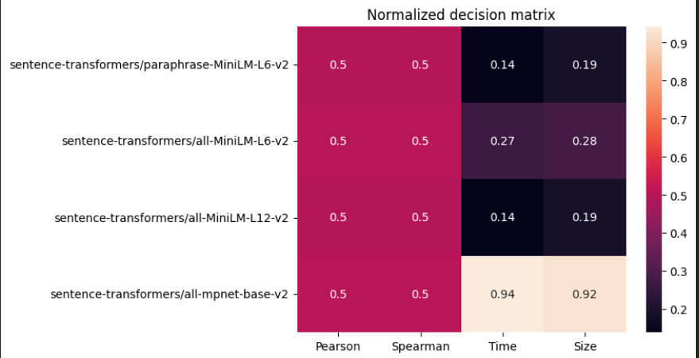
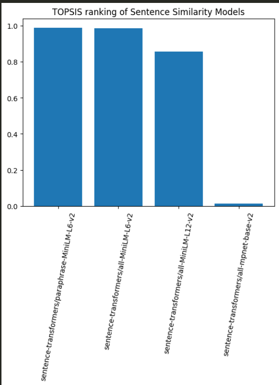

This project identifies the best pre-trained Huggingface models for text sentence similarity using structural deicision-making approach(TOPSIS)

We consider factors like **performance, inference time, model size** for selecting a model.

# Dataset used

I used the STS Benchmark dataset from the GLUE benchmark.

# Evaluation Metrics

- Pearson correlation - Measures linear correlation between the predicted and actual values.
- Spearman correlation - Measures rank based correlation
- Inference time - Time taken to encode dataset
- Model size - Size of the model

# Decision Matrix

| Model                   | Pearson | Spearman | Time (s) | Size (MB) |
| ----------------------- | ------- | -------- | -------- | --------- |
| paraphrase-MiniLM-L6-v2 | 0.869   | 0.870    | 13.95    | 86.64     |
| all-MiniLM-L6-v2        | 0.869   | 0.867    | 14.52    | 86.64     |
| all-MiniLM-L12-v2       | 0.877   | 0.875    | 26.63    | 127.26    |
| all-mpnet-base-v2       | 0.881   | 0.881    | 94.54    | 417.66    |

- mpnet has best correlation scores.
- MiniLM models are significantly faster than mpnet.
- mpnet is much larger in size

## Normalized Decision Matrix

# TOPSIS Ranking

| Rank | Model                   | TOPSIS Score |
| ---- | ----------------------- | ------------ |
| 1    | paraphrase-MiniLM-L6-v2 | 0.987        |
| 2    | all-MiniLM-L6-v2        | 0.985        |
| 3    | all-MiniLM-L12-v2       | 0.857        |
| 4    | all-mpnet-base-v2       | 0.014        |

# Conclusion

paraphrase-MiniLM-L6-v2 is the best balanced model for sentence similarity among the tested models. It provides strong semantic performance while maintaining a good balance between inference time and model size.
